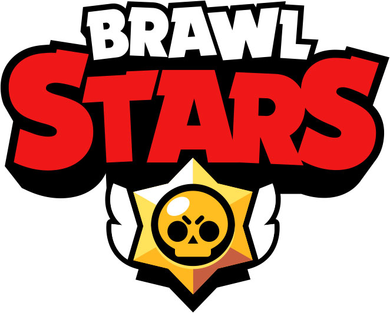
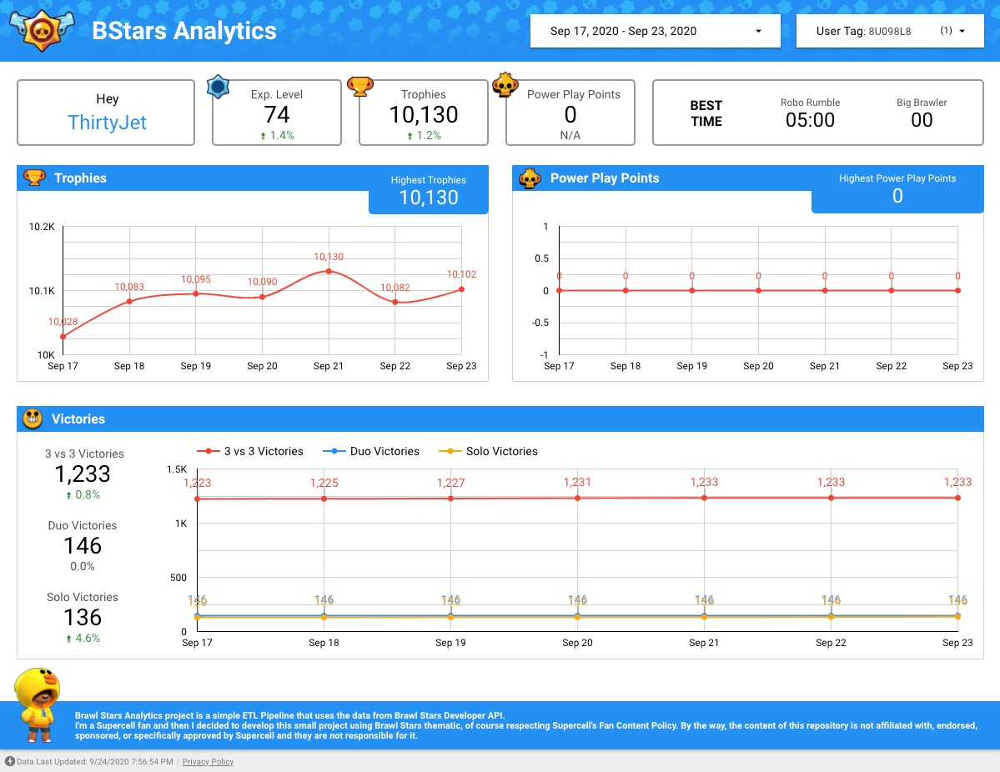

# BStars Analytics
By Anthony Vilarim Caliani


Brawl Stars Analytics project is a simple ETL Pipeline that uses the data from [Brawl Stars Developer API](https://developer.brawlstars.com/).<br>
I'm a [Supercell](https://supercell.com/en/) fan and then I have decided to develop this small project using [Brawl Stars](https://supercell.com/en/games/brawlstars/) thematic, of course respecting Supercell's [Fan Content Policy](http://www.supercell.com/fan-content-policy). By the way, the content of this repository is not affiliated with, endorsed, sponsored, or specifically approved by Supercell and they are not responsible for it.<br>


## 👨‍💻 Let's go!

### Before Starting...
Before starting you need a existant GCloud project and the [GCloud SDK](https://cloud.google.com/storage/docs/gsutil_install#sdk-install) installed on your machine.  
After creating and installing GCloud stuff you have to update `devops/.env` file properly with your own GCloud data.

> 🧙‍♂️ "If in doubt... Always follow your nose" - Gandalf

### Now, let's move on!
First, to interact with **GCloud** via **Docker** container you have to create a Service Account. Then we can build and up the container.
```bash
# 01 - Create the service account
./devops/service-account.sh --create sa-docker

# 02 - Build docker image
docker-compose build

# 03 - Up the container
docker-compose up -d

# When you finish...
docker-compose down
```

### GCloud
Now let's prepare the **GCloud** environment...

```bash
# Creating cloud storage buckets...
./devops/storage.sh --create bstars-repo
./devops/storage.sh --create bstars-logs
./devops/storage.sh --create bstars-transient
```

Deploying **"App Collector"**...

```bash
# 💡 INFO
# - - - - - - - - - - - -
# Before deploying, set the API_TOKEN value in "app-collector/env/prod.env"
# The token can be found at "Brawl Stars Developer API"
./devops/app-deploy.sh app-collector
```

Finally, create some more services in **GCloud**...
```bash
# Compute Instance with static IP Address
./devops/ip-address.sh --create            # Region: us-central1 && Save the IP Address
./devops/compute.sh    --create 127.0.0.1  # Generated IP Address

# Cloud Pub/Sub Topic
./devops/pubsub.sh --create

# Cloud Function
./devops/function.sh --create start-instance

# Cloud Scheduler
./devops/schedule.sh --create
```


### Executing Locally

> **App Collector**<br/>
> This job is responsible to request user data from **Brawl Stars Developer API** and save the data into a JSON file.
> This job was developed to be executed in a Compute Engine Instance, but you can execute it locally as well.  

```bash
# 💡 INFO
# - - - - - - - - - - - -
# Before executing locally, set the API_TOKEN value in "app-collector/env/local.env"
# The token can be found at "Brawl Stars Developer API"
docker-compose exec bstars /app/app-collector/run.sh
```

> **App Processor**<br/>
> This job is responsible to clean, extract and transform the data.
> This Job was developed to be executed locally. Of course it is also prepared to be executed in GCloud, but this was not my objective.
```bash
# 01 - Download files from GCloud
docker-compose exec bstars /app/app-processor/scripts/get-files.sh

# 02 - Process files from transient zone until refined zone
docker-compose exec bstars /app/app-processor/run.sh local raw trusted refined

# 03 - Move file into analytics zone
docker-compose exec bstars /app/app-processor/scripts/single-file.sh
```

## 👨‍🔬 Analytics
This screenshot was taken from **Google Data Studio** report created by me \o/




## 🕵️‍♂️ Related Links
- [Supercell: Official Website](https://supercell.com/en/)
- [Brawl Stars: Developer API](https://developer.brawlstars.com/)
- [Brawl Stars: Media](https://supercell.com/en/for-media/)

