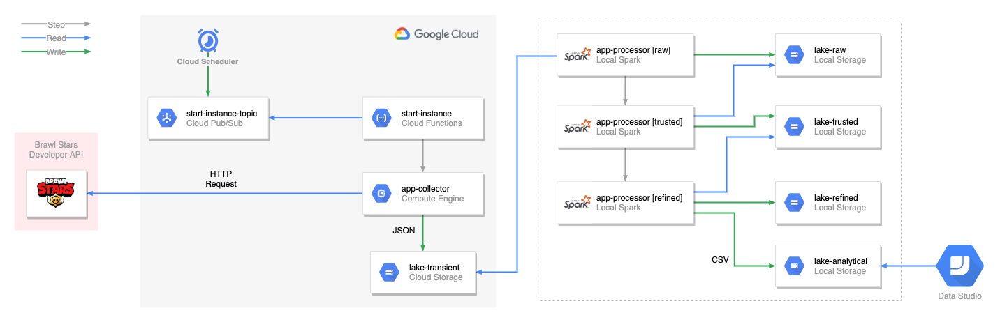

# BStars Analytics
By Anthony Vilarim Caliani


Brawl Stars Analytics project is a simple ETL Pipeline that uses the data from [Brawl Stars Developer API](https://developer.brawlstars.com/).<br>
I'm a [Supercell](https://supercell.com/en/) fan and then I decided to develop this small project using [Brawl Stars](https://supercell.com/en/games/brawlstars/) thematic, of course respecting Supercell's [Fan Content Policy](http://www.supercell.com/fan-content-policy). By the way, the content of this repository is not affiliated with, endorsed, sponsored, or specifically approved by Supercell and they are not responsible for it.<br>


## Diagram



## Quick Start
Let's prepare our local environment.  
First, to interact with GCloud we have to create a Service Account.
```bash
./devops/service-account.sh --create sa-airflow
```

Then, build docker image...
```bash
docker-compose build
```

Finally, start docker container.
```bash
docker-compose up -d
```

When you finish, shutdown the container.
```bash
docker-compose down
```

### Executing Jobs Locally

#### App Collector
> **💡 Hint!**<br>
> Before executing, set the `API_TOKEN` value in `app-collector/env/local.env`.<br>
> The token can be found at [Brawl Stars Developer API](https://developer.brawlstars.com/).
```bash
docker-compose exec bstars /app/app-collector/run.sh
```

#### App Processor
```bash
docker-compose exec bstars /app/app-processor/scripts/get-files.sh
docker-compose exec bstars /app/app-processor/run.sh local raw
docker-compose exec bstars /app/app-processor/run.sh local trusted
```


## GCloud
Let's prepare the GCLoud environment...

### First Deploy

Creating Buckets
```bash
./devops/storage.sh --create bstars-repo
./devops/storage.sh --create bstars-logs
./devops/storage.sh --create bstars-transient
./devops/storage.sh --create bstars-raw
```

Deploying Apps
```bash
./devops/app-deploy.sh app-collector
```

Creating Compute Instance
```bash
./devops/ip-address.sh --create  # Region: us-central1 && Save the IP Address
./devops/compute.sh --create 127.0.0.1  # Generated IP Address
```

Creating Cloud Pub/Sub Topic, Cloud Function, and Cloud Scheduler services
```bash
./devops/pubsub.sh --create
./devops/function.sh --create start-instance
./devops/schedule.sh --create
```


## Screenshots


## Related Links
- [Supercell: Official Website](https://supercell.com/en/)
- [Brawl Stars: Developer API](https://developer.brawlstars.com/)
- [Brawl Stars: Media](https://supercell.com/en/for-media/)

